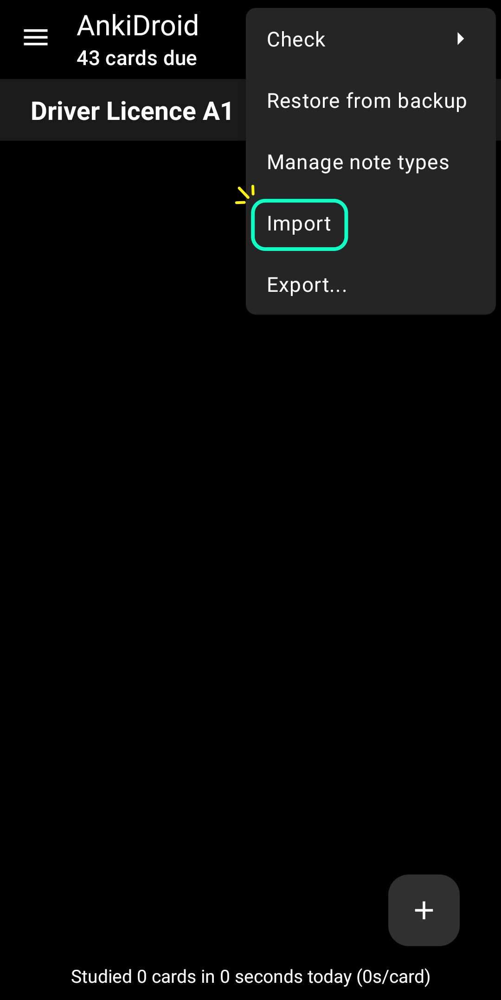
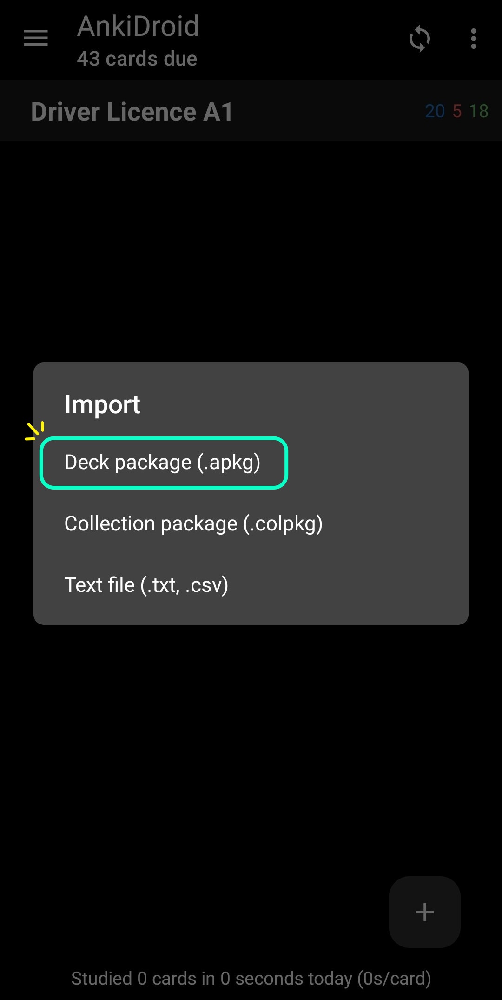

# Traffic rules questions for A1 driver licence test.
The flashcards are based on "CLASE A - CATEGORÍA I" questions published here: [Evaluacion de conocimientos - MTC](https://portal.mtc.gob.pe/transportes/terrestre/licencias/evaluacion-de-conocimientos.html)

## How to import the flashcards into Ankidroid?
### First Step
Install **Ankidroid**, it's available in PlayStore & F-Droid.

  
  

### Second Step
Download the `Driver Licence A1.apkg` file stored in this repository and then import it into the Ankidroid application.

  
  

## What is Anki?
---
> Anki is a program which makes remembering things easy. Because it's a lot more efficient than traditional study methods, you can either greatly decrease your time spent studying, or greatly increase the amount you learn. 

— [Anki website](https://apps.ankiweb.net/) 
